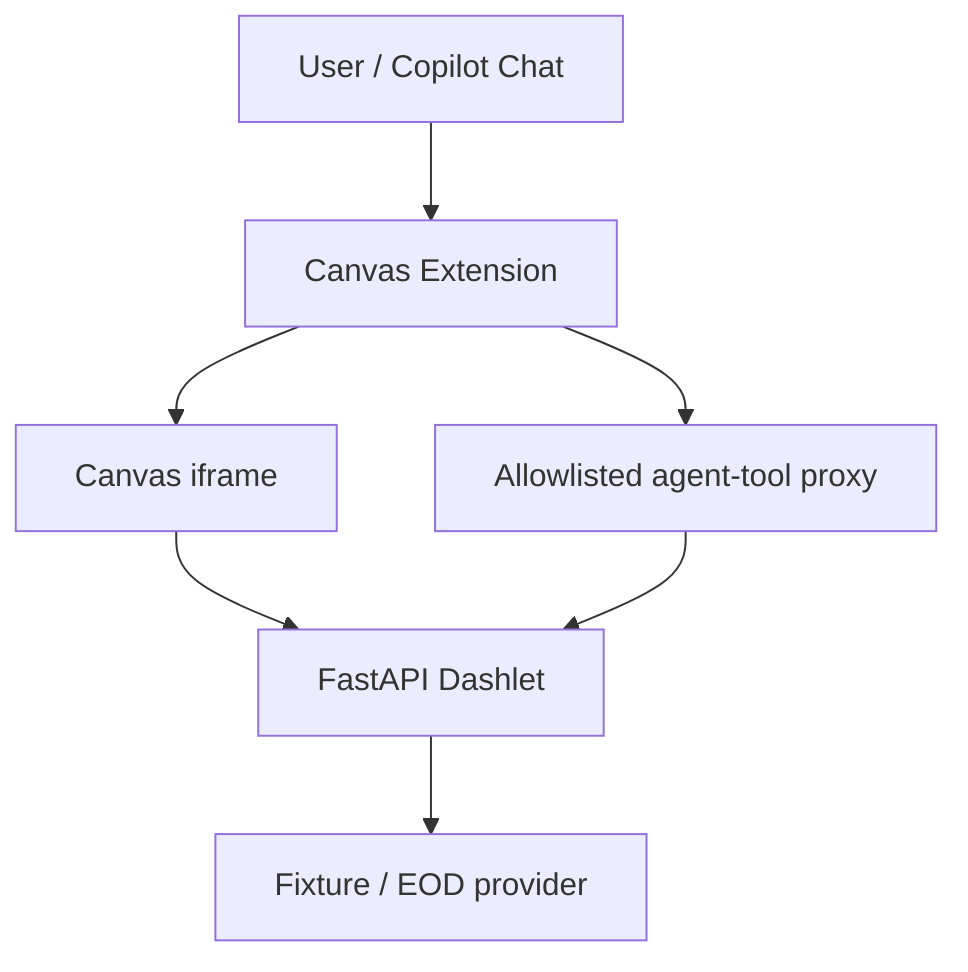

# Canvas Dashlet Studio

A GitHub Copilot Canvas extension and small Python/FastAPI runtime for building **dashlets**: single-file financial monitors that render in a Canvas iframe and expose the same typed operations to Copilot as agent tools.

This repository currently ships two working dashlets — **Hello** (a smoke test) and **Treasury Curve** (a reference application with fixture and official end-of-day data) — plus the reusable pieces needed to run, extend and validate them.

## 1. What is a dashlet?

A dashlet is a single Python file containing a FastAPI application: its API, embedded HTML/CSS/JavaScript, and one or more typed data or analytics endpoints. It runs as a local process, is displayed inside a Canvas iframe, and can retrieve fixture, live or end-of-day data through a server-side provider.

## 2. Why Canvas + FastAPI + agent tools?

This remains an ordinary client-server web architecture — a browser-rendered iframe talking to a FastAPI backend — with one addition: an **agentic integration layer**. The Canvas extension starts the FastAPI process locally, displays it in an iframe, and separately discovers a subset of its OpenAPI operations to register as Copilot agent tools. No new business logic or protocol is introduced by the agent path; it reuses the same HTTP endpoints the iframe already calls.

## 3. What works today

- Dashlet Studio Canvas extension: select, start, stop, restart, and view diagnostics for either dashlet; only one dashlet process runs at a time.
- Hello Dashlet: minimal end-to-end smoke test (`get_dashlet_summary` tool).
- Treasury Curve dashlet: interactive yield curve, slopes and comparison views with explicit fixture/EOD data-mode selection.
- Agent-tool bridge: only FastAPI operations tagged `agent-tool` and present in the extension's allowlist become Copilot tools; tool arguments are validated before any provider call; tools are isolated per active dashlet (Hello's tool is unavailable while Treasury is active, and vice versa).
- Automated Python (`pytest`) and Node (`node --test`) test suites for the dashlet contract, providers, Canvas runtime, tool proxy and Treasury tool schemas.

See [`docs/PROGRESS.md`](docs/PROGRESS.md) for the full milestone checklist, current status and the `## Resume here` section describing the next task.

## 4. Treasury reference application

The Treasury Curve dashlet (`dashlets/treasury_curve_dashlet.py`) is the manually built reference implementation used to learn and validate the whole platform contract. It exposes three agent-tool-tagged operations — `get_treasury_curve`, `get_treasury_curve_slopes`, `compare_treasury_curves` — each requiring an explicit `data_mode` query parameter (`fixture` or `eod`), with no silent default and no fallback to fixture data if an EOD request fails.

**Treasury EOD data is official end-of-day data retrieved from Treasury.gov — it is not intraday, real-time market data.**

Full validation evidence, including live fixture/EOD results, provenance examples and known limitations, is in [`docs/evidence/treasury-reference.md`](docs/evidence/treasury-reference.md).

## 5. Architecture at a glance



The iframe and the Copilot agent both call the **same** FastAPI business operation — `fetch("./api/treasury/curve?...")` from the embedded JavaScript, and the identical `/api/treasury/curve` path via the Canvas tool proxy for the agent. This avoids duplicated business logic and keeps provenance identical for both consumers. See [`docs/ARCHITECTURE.md`](docs/ARCHITECTURE.md) for the full component and data-flow diagrams.

## 6. Technology stack

| Area | Choice |
|---|---|
| Agent workspace | GitHub Copilot App and Canvas |
| Canvas extension | JavaScript / Node.js |
| Runtime | Python, FastAPI, Uvicorn |
| Contracts | Pydantic and OpenAPI |
| Data | HTTPX, provider adapters, deterministic fixtures |
| UI | HTML, Alpine.js, Tailwind CSS, Plotly.js |
| Quality | Pytest, FastAPI `TestClient`, Ruff, Node's built-in test runner |
| Dependency management | `uv` (Python), `npm` (Node) |

## 7. Quick start

Install prerequisites per [`INSTALL.md`](INSTALL.md), then from the repository root:

```bash
uv sync
```

Run the Treasury dashlet directly (outside Canvas), for browser or `curl` testing:

```bash
uv run uvicorn dashlets.treasury_curve_dashlet:app --host 127.0.0.1 --port 8765
```

```bash
curl "http://127.0.0.1:8765/health"
curl "http://127.0.0.1:8765/api/treasury/curve?data_mode=fixture"
```

## 8. Running tests

```bash
uv run ruff check .
uv run pytest
```

```bash
cd .github/extensions/dashlet-studio
npm test
```

Current status of these commands against this branch is recorded in [`docs/evidence/treasury-reference.md`](docs/evidence/treasury-reference.md) — including a small number of pre-existing, out-of-scope failures that are called out explicitly rather than hidden.

## 9. Opening Dashlet Studio Canvas

From a Copilot session with this repository open, invoke the `dashlet-studio` Canvas extension. It exposes actions to select a dashlet (`hello` or `treasury-curve`), start it, view runtime diagnostics, restart it, and stop it. Only one dashlet process runs at a time; switching dashlets stops the previous process before starting the next.

## 10. Using Treasury through the iframe

Once the Treasury Curve dashlet is running and displayed in the Canvas iframe, use the on-page controls to choose an observation date and a Data Mode (`fixture` or `eod`). The curve, slope cards, and (when both a base and compare date are selected) the comparison table update together, along with the provenance line showing source, observation date and data mode.

## 11. Using Treasury as an agent tool

While the Treasury Curve dashlet is active, ask Copilot a data question, for example:

> Use the Treasury curve tool to get the fixture curve for 2026-08-19.

Copilot selects the matching approved tool (`get_treasury_curve`, `get_treasury_curve_slopes`, or `compare_treasury_curves`), the Canvas tool proxy validates the arguments against an explicit JSON schema (including the required `data_mode` enum), forwards the request to the same FastAPI endpoint the iframe uses, and returns the validated, provenance-tagged response.

## 12. Fixture versus EOD modes

Every Treasury operation requires an explicit `data_mode`:

- `fixture` — deterministic, recorded sample data. Safe for demos, tests and CI; no network calls.
- `eod` — official end-of-day yield data fetched live from Treasury.gov.

`data_mode` has no default value: omitting it, or passing an unsupported value, is rejected before any provider is invoked (HTTP 422 from FastAPI, or a client-side rejection in the Canvas tool proxy). An EOD request failure is never silently served from fixture data.

## 13. Evidence and screenshots

See [`docs/evidence/treasury-reference.md`](docs/evidence/treasury-reference.md) for the full validation record: direct FastAPI checks, live Canvas agent-tool invocations, tool-isolation negative tests, process-lifecycle results, and Python/Node test summaries.


A genuine Canvas screenshot (EOD mode) is included above; see [`docs/evidence/treasury-reference.md`](docs/evidence/treasury-reference.md#screenshot) for capture details and provenance.

## 14. Repository structure

```text
dashlets/                          Dashlet FastAPI applications (Hello, Treasury Curve) + Treasury provider
fixtures/treasury/                 Deterministic Treasury fixture data
tests/                             Python pytest suite
tests/js/                          Node-based behavioral tests for the Treasury iframe client
scripts/                           Manual/ad hoc verification scripts (not part of CI)
.github/extensions/dashlet-studio/ Canvas extension: process launcher, tool proxy, control server
docs/                              Installation, architecture, roadmap, progress and evidence documentation
```

## 15. Current limitations

- Only Hello and Treasury Curve are implemented; Portfolio Exposure, Portfolio Scenario Impact and Issuer Research are future work.
- No CI workflow exists yet in this repository.
- No production sandbox, persistent artifact store, or production identity/authorization model.
- No hosted gallery; all verification has been against locally spawned processes.
- See [`docs/PROGRESS.md`](docs/PROGRESS.md) "Known limitations" for the complete list.

## 16. Roadmap

See [`docs/ROADMAP.md`](docs/ROADMAP.md) for the staged execution plan and [`docs/PROGRESS.md`](docs/PROGRESS.md#resume-here) for the prioritized next task (adding CI for Ruff, Pytest and the Node test suite).

## 17. Documentation map

| Document | Purpose |
|---|---|
| [`INSTALL.md`](INSTALL.md) | Prerequisites and environment verification |
| [`docs/PROPOSAL.md`](docs/PROPOSAL.md) | Original scope, deliverables and staged evolution |
| [`docs/ARCHITECTURE.md`](docs/ARCHITECTURE.md) | Component boundaries and end-to-end flows |
| [`docs/ROADMAP.md`](docs/ROADMAP.md) | Execution plan and learning resources |
| [`docs/AGENTIC_DEVELOPMENT.md`](docs/AGENTIC_DEVELOPMENT.md) | How coding agents should be used on this project |
| [`docs/PROGRESS.md`](docs/PROGRESS.md) | Milestone checklist, current status and "Resume here" |
| [`docs/evidence/treasury-reference.md`](docs/evidence/treasury-reference.md) | Treasury milestone validation evidence |
| [`docs/REFERENCES.md`](docs/REFERENCES.md) | Verified external documentation and learning references |

## 18. References

External documentation for every technology used in this project — GitHub Copilot App, Canvas extensions, FastAPI, Pydantic, Alpine.js, `uv`, Treasury data, and more — is curated in [`docs/REFERENCES.md`](docs/REFERENCES.md).

## 19. Contributing / public-repository safety guidance

This is a public repository. Before committing or opening a pull request:

- Never commit secrets, API keys or tokens; use an ignored `.env` for local-only values.
- Use recorded fixtures instead of live external calls in tests and CI.
- Keep dashlet endpoints restricted to registered providers; do not accept arbitrary URLs or shell commands from requests.
- Run `uv run ruff check .`, `uv run pytest`, and `npm test` (from `.github/extensions/dashlet-studio`) before opening a pull request, and report any pre-existing failures honestly rather than silently working around them.
- Avoid overstating readiness: this project is an MVP-stage reference implementation, not a production system.
