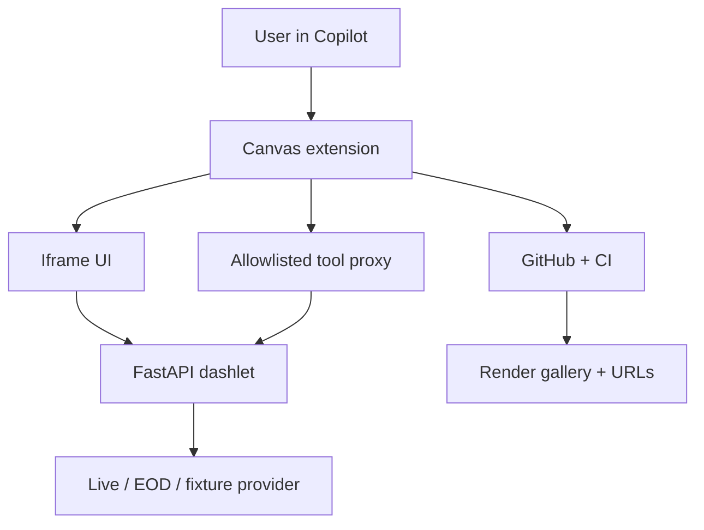

# Canvas Dashlet Studio — Proposal Package

This package defines a short, project-driven learning and development program for building a Python-first, Canvas-hosted dashlet platform.

A dashlet is a single-file Python FastAPI application containing its API, embedded HTML and JavaScript. It renders inside a Canvas iframe, retrieves live or end-of-day data through server-side providers, and exposes selected typed operations to the Copilot agent as tools.

The key platform contract is: **one typed business operation, two consumers**. Iframe JavaScript and the Copilot agent both call the same FastAPI endpoint.

## Scope

The MVP includes a project-scoped Canvas extension, safe local Python launcher, reusable dashlet contract, iframe preview, provider adapters, OpenAPI-to-tool proxy, four defined financial use cases, tests, CI and a Render gallery. Identity, durable storage, production sandboxing, scheduled jobs, enterprise data integration and advanced observability are later stages.

## Technology stack

| Area | MVP choice | Purpose |
|---|---|---|
| Agent workspace | GitHub Copilot App and Canvas | Requests, iframe preview and tool invocation |
| Extension | JavaScript/Node.js | Canvas lifecycle, process control and tool proxy |
| Runtime | Python, FastAPI, Uvicorn | Dashlet HTML, data and analytics endpoints |
| Contracts | Pydantic and OpenAPI | Typed requests/responses and tool discovery |
| Data | HTTPX and provider adapters | Live, EOD and deterministic fixture sources |
| UI | HTML, Alpine.js, Tailwind CSS, Plotly.js | Interactive visuals without transpilation |
| Quality | Pytest, TestClient, Ruff, GitHub Actions | Contract, provider and CI validation |
| Publishing | Render | Simple direct and iframe-compatible prototype URLs |

React, TypeScript, a bundler, MCP, RAG and orchestration frameworks are not required for the MVP. MCP can be added later; ordinary approved REST APIs work now.

The project is designed to teach the platform from the inside out:

1. Manually build one representative dashlet to understand the runtime contract.
2. Build the reusable framework and Canvas execution path.
3. Teach coding agents the contract through durable repository guidance.
4. Generate additional dashlets agentically.
5. Validate, review, version and publish the resulting applications.

## Documents

Read these files in order:

1. [INSTALL.md](INSTALL.md) — install and verify all prerequisites before development.
2. [PROPOSAL.md](PROPOSAL.md) — goals, scope, deliverables and staged evolution.
3. [ARCHITECTURE.md](ARCHITECTURE.md) — component boundaries and end-to-end flows.
4. [ROADMAP.md](ROADMAP.md) — 2–3 day execution plan with learning resources introduced as needed.
5. [AGENTIC_DEVELOPMENT.md](AGENTIC_DEVELOPMENT.md) — how Copilot App, Copilot CLI, Codex and Claude Code should be used.
6. [PROGRESS.md](PROGRESS.md) — milestone and evidence tracker.

## Proposed end product

The eventual GitHub repository will contain:

- A project-scoped GitHub Copilot Canvas extension.
- A small reusable Python dashlet framework.
- A safe local process launcher.
- OpenAPI-to-agent-tool discovery and proxying.
- A contract validator and test suite.
- Four defined PM-oriented reference use cases, with at least three completed during the initial sprint.
- Additional stretch dashlets after the core vertical slice.
- A FastAPI gallery host deployed from GitHub to Render.
- Durable authoring and review guidance for coding agents.

## Core demonstration

The project is successful when a user can:

1. Request a PM monitor in Copilot Canvas.
2. Have an agent generate or modify a single-file Python dashlet.
3. Validate the dashlet deterministically.
4. Start it as a local FastAPI/Uvicorn process.
5. View it in the Canvas iframe.
6. Interact with live or EOD data through its REST endpoints.
7. Ask Copilot a data question that invokes an approved endpoint as a tool.
8. Publish the validated source through GitHub and obtain a hosted URL.

## Reference business use cases

1. Treasury Curve Monitor — rates and curve analysis.
2. Portfolio Exposure and Concentration Monitor — holdings, sectors and issuer concentration.
3. Portfolio Scenario Impact Explorer — deterministic shocks and contribution analysis.
4. Issuer Research Monitor — public filing facts, operating trends and source-linked research data.

Candidate agent tools include:

| Dashlet | Examples |
|---|---|
| Treasury Curve | `get_treasury_curve`, `compare_treasury_curves`, `get_curve_slopes` |
| Portfolio Exposure | `get_portfolio_exposures`, `get_top_concentrations` |
| Scenario Impact | `run_portfolio_scenario`, `get_scenario_contributions` |
| Issuer Research | `get_company_facts`, `get_financial_trends`, `list_recent_filings` |

## Data as agent tools

Each completed use case must expose at least one typed, explicitly approved business operation to Copilot:

```python
@app.get(
    "/api/portfolio/exposures",
    operation_id="get_portfolio_exposures",
    tags=["agent-tool"],
    response_model=ExposureResponse,
)
def get_portfolio_exposures() -> ExposureResponse:
    ...
```

- **Iframe path:** Alpine calls `fetch("./api/portfolio/exposures")`; FastAPI calls the provider; Plotly renders the typed response.
- **Agent path:** Copilot selects `get_portfolio_exposures`; the Canvas proxy validates arguments, calls the same endpoint, validates the response and returns structured data.

Only operations tagged `agent-tool` and present in the extension allowlist are registered. HTML, health, metadata, administration and internal provider routes are never tools. Every result includes source, observation time, retrieval time and fixture/live status.

## Architecture at a glance



## Roadmap ahead

1. **Day 1:** manually build the Treasury dashlet while learning FastAPI, Pydantic/OpenAPI, Alpine and Plotly.
2. **Day 2:** build Canvas launch/reload, iframe and dual-use agent-tool paths.
3. **Day 3:** agentically generate two more apps, review them independently, add CI and publish the gallery.
4. **Later:** add artifact lifecycle, identity/governance, stronger sandboxing, observability, scheduling and enterprise integrations.

## Definition of done

- At least three financial use cases share the framework.
- Each completed use case has an approved typed endpoint callable by both its UI and Copilot.
- Untagged endpoints are not tools; invalid arguments fail before provider execution.
- Provenance survives both response paths.
- CI passes and the gallery publishes direct URLs, with at least one iframe verification.
