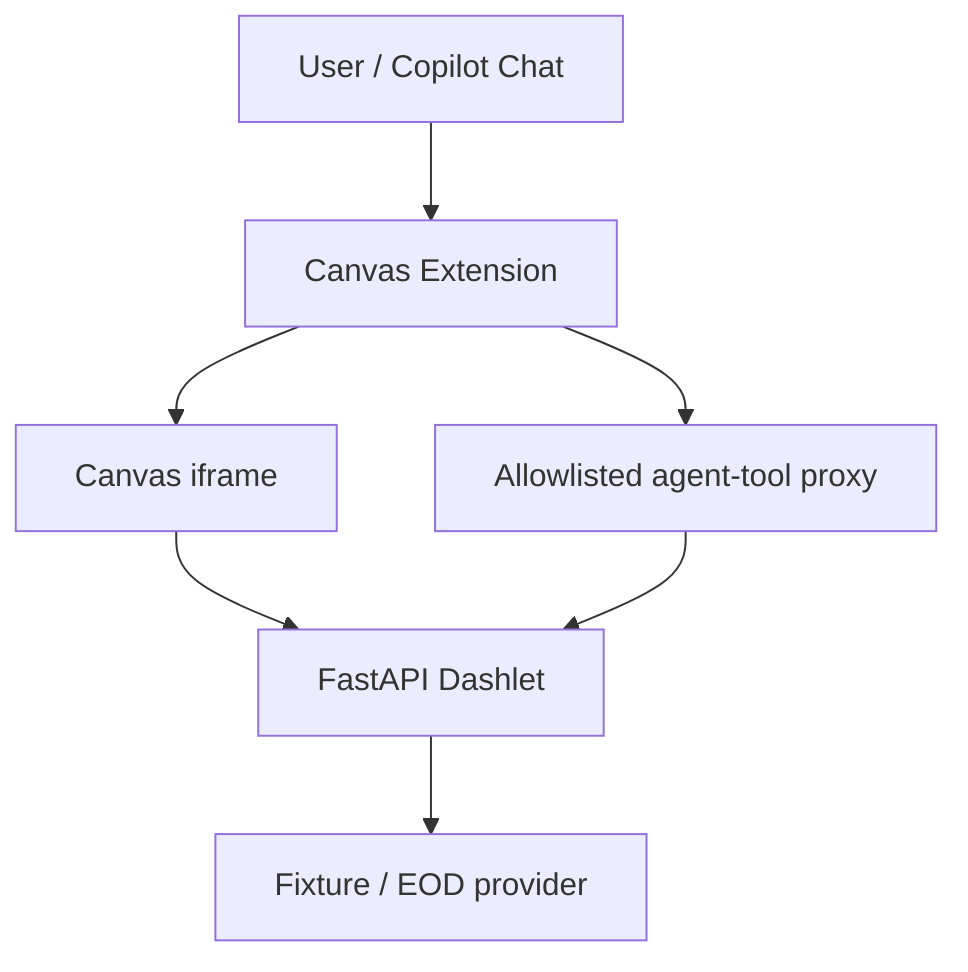
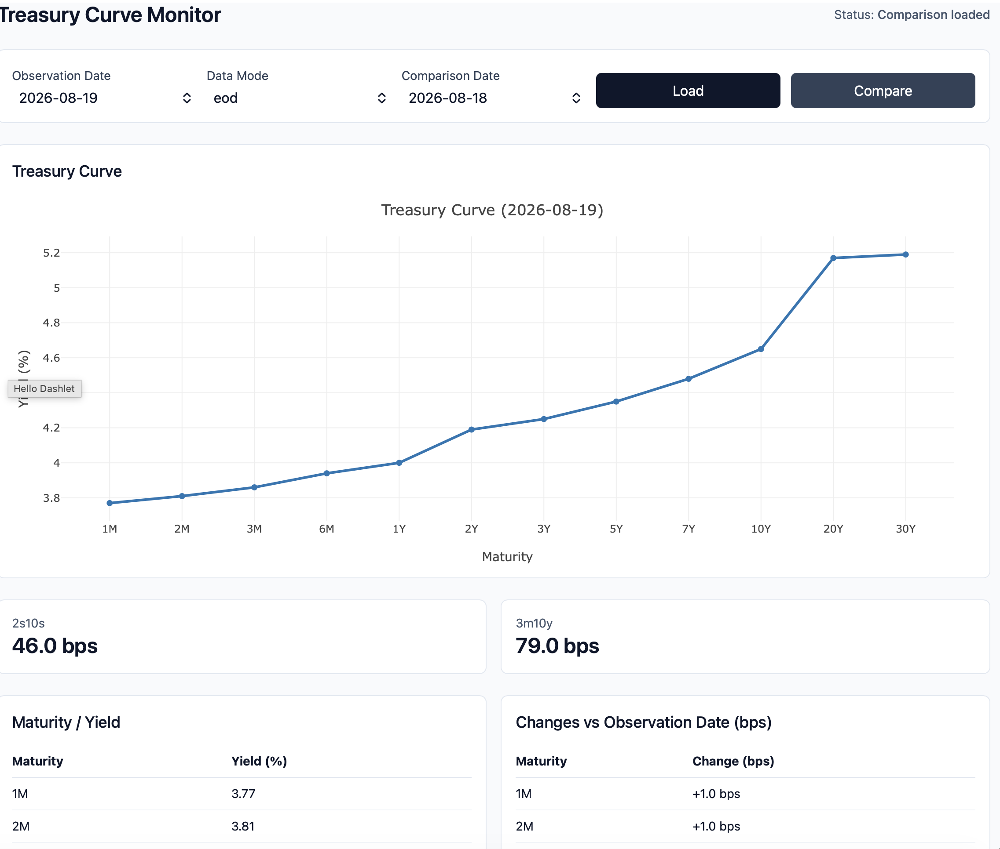

# Canvas Dashlet Studio

A GitHub Copilot Canvas extension and small Python/FastAPI runtime for building **dashlets**: single-file financial monitors that render in a Canvas iframe and expose the same typed operations to Copilot as agent tools.

This repository ships all four originally planned reference dashlets — **Hello** (a smoke test), **Treasury Curve** (fixture and official end-of-day Treasury.gov data), **Portfolio Exposure** (deterministic long/short/net exposure and concentration from mock positions), **Portfolio Scenario Impact** (deterministic rate/spread/equity shock analysis on the same mock positions), and **Issuer Research** (real, live SEC EDGAR company facts and filings for any of ~10,388 public companies) — plus the reusable pieces needed to run, extend and validate them.

## 1. What is a dashlet?

A dashlet is a single Python file containing a FastAPI application: its API, embedded HTML/CSS/JavaScript, and one or more typed data or analytics endpoints. It runs as a local process, is displayed inside a Canvas iframe, and can retrieve fixture, live or end-of-day data through a server-side provider.

## 2. Why Canvas + FastAPI + agent tools?

This remains an ordinary client-server web architecture — a browser-rendered iframe talking to a FastAPI backend — with one addition: an **agentic integration layer**. The Canvas extension starts the FastAPI process locally, displays it in an iframe, and separately discovers a subset of its OpenAPI operations to register as Copilot agent tools. No new business logic or protocol is introduced by the agent path; it reuses the same HTTP endpoints the iframe already calls.

## 3. What works today

- Dashlet Studio Canvas extension: select, start, stop, restart, and view diagnostics for any registered dashlet; only one dashlet process runs at a time.
- Hello Dashlet: minimal end-to-end smoke test (`get_dashlet_summary` tool).
- Treasury Curve dashlet: interactive yield curve, slopes and comparison views with explicit fixture/EOD data-mode selection.
- Portfolio Exposure dashlet: deterministic long/short/net exposure by sector and issuer, top concentrations, and a sector-level snapshot comparison, from mock fixture positions (`get_portfolio_exposures`, `get_top_concentrations`, `compare_portfolio_exposures` tools).
- Portfolio Scenario Impact dashlet: deterministic rate/spread/equity shock impact on the same mock positions — total/position/sector-level impact and a two-scenario comparison (`run_portfolio_scenario`, `get_scenario_contributions`, `compare_scenario_impacts` tools).
- Issuer Research dashlet: real public-company financial facts, multi-year trends and filing timelines from SEC EDGAR, for any of ~10,388 SEC-registered tickers in live mode (`get_company_facts`, `get_financial_trends`, `list_recent_filings` tools).
- A shared `dashlet_framework/` package (`create_dashlet_app`, the `agent-tool` tag constant, `Provenance`, and error-response models) so every dashlet reuses the same `/health` implementation, error shapes and provenance model instead of duplicating them.
- Agent-tool bridge: only FastAPI operations tagged `agent-tool` and present in the extension's allowlist become Copilot tools; tool arguments are validated before any provider call; tools are isolated per active dashlet. Tool parameter schemas are generated from each dashlet's real OpenAPI output (`scripts/generate_tool_schemas.py`), not hand-maintained.
- Reusable dashlet/OpenAPI contract validation (`tests/test_dashlet_contract.py`, `.github/extensions/dashlet-studio/dashlet-registry.test.mjs`): every registered dashlet is checked automatically for required routes, agent-tool tagging correctness, unique operation IDs and mount-relative fetch paths, with no per-dashlet test code required.
- CI (`.github/workflows/ci.yml`): Ruff, Pytest, a tool-schema drift check, and the Canvas extension's `npm test` run on every push/PR.
- Automated Python (`pytest`) and Node (`node --test`) test suites for the dashlet contract, framework, providers, Canvas runtime, tool proxy and generated tool schemas.

See [`docs/PROGRESS.md`](docs/PROGRESS.md) for the full milestone checklist, current status and the `## Resume here` section describing the next task, and [`AGENTS.md`](AGENTS.md) for the canonical contract any agent (or human) should follow when changing this repository.

## 4. Treasury reference application

The Treasury Curve dashlet (`dashlets/treasury_curve_dashlet.py`) is the manually built reference implementation used to learn and validate the whole platform contract. It exposes three agent-tool-tagged operations — `get_treasury_curve`, `get_treasury_curve_slopes`, `compare_treasury_curves` — each requiring an explicit `data_mode` query parameter (`fixture` or `eod`), with no silent default and no fallback to fixture data if an EOD request fails.

**Treasury EOD data is official end-of-day data retrieved from Treasury.gov — it is not intraday, real-time market data.**

Full validation evidence, including live fixture/EOD results, provenance examples and known limitations, is in [`docs/evidence/treasury-reference.md`](docs/evidence/treasury-reference.md).

## 5. Portfolio Exposure reference application

The Portfolio Exposure dashlet (`dashlets/portfolio_exposure_dashlet.py`) is the first dashlet built on the extracted `dashlet_framework` after the Treasury milestone — it demonstrates the framework generalizing to a second, unrelated business domain. It exposes three agent-tool-tagged operations:

- `get_portfolio_exposures` — long/short/net market value by sector and by issuer for one observation date.
- `get_top_concentrations` — the top issuer and sector concentrations by absolute net exposure weight (`top_n`, bounded 1–20).
- `compare_portfolio_exposures` — sector-level net exposure deltas between two observation dates.

Positions come from deterministic mock fixtures (`fixtures/portfolio/positions_*.json`) — 12 positions across 5 sectors, including two short positions. **There is no live holdings provider for this dashlet**: unlike Treasury's fixture/EOD split, Portfolio Exposure has only a fixture data mode, since PROPOSAL.md's use case is built from mock positions, not a real feed. See [`docs/DATA_ACCESS.md`](docs/DATA_ACCESS.md) §2 for why fixture-first development doesn't always grow a second, live mode.

## 6. Portfolio Scenario Impact reference application

The Portfolio Scenario Impact dashlet (`dashlets/portfolio_scenario_dashlet.py`) is the third business-use-case dashlet, and the second built on `dashlet_framework` without any framework changes. It applies bounded, deterministic multi-factor shocks to the **same** portfolio positions Portfolio Exposure reads (`portfolio_fixture.Position`, extended with optional `duration`, `spread_duration` and `beta` fields — one portfolio, multiple lenses, per an explicit design decision). Three agent-tool-tagged operations:

- `run_portfolio_scenario` — apply a rate shock (bps, bounded ±300), spread shock (bps, bounded ±500) and/or equity shock (%, bounded ±50) and return total, position-level and sector-level impact.
- `get_scenario_contributions` — the top position-level impact contributions (`top_n`, bounded 1–20) plus sector-level contributions, for the same shock.
- `compare_scenario_impacts` — two full, independent shock specifications ("scenario A" vs. "scenario B") applied to the same portfolio, returning both totals and per-sector deltas.

The calculation is a deterministic, linear first-order approximation, computed entirely in Python (never by the language model):

```text
position_impact = -duration        * market_value * (rate_shock_bps   / 10,000)
                 + -spread_duration * market_value * (spread_shock_bps / 10,000)
                 +  beta            * market_value * (equity_shock_pct / 100)
```

Rate and spread shocks flip sign (yields rising / spreads widening reduce the value of a long, positive-duration position — the same inverse price/yield relationship the Treasury dashlet's data represents); equity shocks move with beta in the same direction as the shock. Short positions (negative `market_value`) produce correctly-signed impact with no special-casing.

**All 12 fixture positions currently have `duration = 0.0` and `spread_duration = 0.0`** — this is an all-equity book with no fixed-income holdings, so a rate or spread shock correctly shows **$0 impact** on it today. That's an intentional, tested property of the fixture data (`test_real_fixtures_have_sector_beta_and_zero_duration`), not a gap: the rate/spread math itself is thoroughly unit-tested against synthetic non-zero-duration positions in `tests/test_scenario_fixture.py`, independent of what the shipped fixture happens to contain.

## 7. Issuer Research reference application

The Issuer Research dashlet (`dashlets/issuer_research_dashlet.py`) is the fourth and last of the originally planned reference use cases, and the only one built on **real public data by default rather than mock data** — it reads directly from [SEC EDGAR's public APIs](https://www.sec.gov/os/webmaster-faq#developers) (`data.sec.gov`), no API key required. Three agent-tool-tagged operations:

- `get_company_facts` — the latest normalized revenue, operating margin, leverage ratio and operating cash flow for one issuer, with a source accession-number link to the actual SEC filing for every underlying figure.
- `get_financial_trends` — the same normalized measures across up to 5 recent fiscal years (`years`, bounded 1–5).
- `list_recent_filings` — a recent 10-K/10-Q/8-K filing timeline (`limit`, bounded 1–8; optional `form_type` filter), each with a direct EDGAR source link.

Like Treasury, this dashlet has an explicit, required `data_mode` (typed directly as the `IssuerDataMode` enum, so the constraint shows up natively in OpenAPI and therefore in the generated Copilot tool schema — no silent default):

- `fixture` — two **recorded real** SEC snapshots (AAPL, Apple Inc.; MSFT, Microsoft Corp), frozen for deterministic, network-free testing. This is genuinely real historical data, not synthetic/fictional numbers — see `scripts/generate_issuer_fixtures.py`.
- `live` — fetches current data from SEC EDGAR for **any of the ~10,388 SEC-registered tickers**, not just the two fixture companies.

Normalization is deterministic Python, not LLM-computed: `operating_margin_pct = operating_income / revenue * 100`, `leverage_ratio = total_liabilities / stockholders_equity`, both guarded against zero-denominator division. Revenue is extracted by trying a small list of XBRL concept tags and picking whichever one's data covers the **most recent** fiscal period — see the note below on why "first available" was the wrong rule.

**A real bug found and fixed while building this**: NVIDIA reported revenue under the `RevenueFromContractWithCustomerExcludingAssessedTax` XBRL tag through fiscal year 2022, then migrated to the plain `Revenues` tag from FY2023 onward. A naive "first non-empty candidate" concept-selection rule locks onto the superseded tag forever and silently returns stale data as "latest." `issuer_fixture._most_recent_concept` instead picks whichever candidate concept's data covers the most recent period end — verified against real Apple, Microsoft and NVIDIA data, with a regression test reproducing the exact failure mode.

## 8. Architecture at a glance



The iframe and the Copilot agent both call the **same** FastAPI business operation — `fetch("./api/treasury/curve?...")` from the embedded JavaScript, and the identical `/api/treasury/curve` path via the Canvas tool proxy for the agent. This avoids duplicated business logic and keeps provenance identical for both consumers. See [`docs/ARCHITECTURE.md`](docs/ARCHITECTURE.md) for the full component and data-flow diagrams.

## 9. Technology stack

| Area | Choice |
|---|---|
| Agent workspace | GitHub Copilot App and Canvas |
| Canvas extension | JavaScript / Node.js |
| Runtime | Python, FastAPI, Uvicorn |
| Shared framework | `dashlet_framework` (app factory, provenance/error models) — Python, no new runtime dependency |
| Contracts | Pydantic and OpenAPI — OpenAPI is also the source `scripts/generate_tool_schemas.py` reads to generate Canvas tool schemas (see [`docs/ARCHITECTURE.md`](docs/ARCHITECTURE.md) §6) |
| Data | HTTPX, provider adapters, deterministic fixtures, [SEC EDGAR public APIs](https://www.sec.gov/os/webmaster-faq#developers) (Issuer Research live mode) |
| UI | HTML, Alpine.js, Tailwind CSS, Plotly.js |
| Quality | Pytest, FastAPI `TestClient`, Ruff, Node's built-in test runner, generic dashlet-contract validation (`tests/test_dashlet_contract.py`, `dashlet-registry.test.mjs`) |
| CI | GitHub Actions (`.github/workflows/ci.yml`) — Ruff, Pytest, tool-schema drift check, `npm test` |
| Dependency management | `uv` (Python), `npm` (Node) |

## 10. Quick start

Install prerequisites per [`INSTALL.md`](INSTALL.md), then from the repository root:

```bash
uv sync
```

Run a dashlet directly (outside Canvas), for browser or `curl` testing:

```bash
uv run uvicorn dashlets.treasury_curve_dashlet:app --host 127.0.0.1 --port 8765
# or: uv run uvicorn dashlets.portfolio_exposure_dashlet:app --host 127.0.0.1 --port 8765
# or: uv run uvicorn dashlets.portfolio_scenario_dashlet:app --host 127.0.0.1 --port 8765
# or: uv run uvicorn dashlets.issuer_research_dashlet:app --host 127.0.0.1 --port 8765
```

```bash
curl "http://127.0.0.1:8765/health"
curl "http://127.0.0.1:8765/api/treasury/curve?data_mode=fixture"
curl "http://127.0.0.1:8765/api/portfolio/exposures"                          # Portfolio Exposure dashlet
curl "http://127.0.0.1:8765/api/scenario/run?equity_shock_pct=10"             # Portfolio Scenario Impact dashlet
curl "http://127.0.0.1:8765/api/issuer/facts?ticker=AAPL&data_mode=fixture"   # Issuer Research dashlet (recorded)
curl "http://127.0.0.1:8765/api/issuer/facts?ticker=NVDA&data_mode=live"      # Issuer Research dashlet (real SEC data, any ticker)
```

## 11. Running tests

```bash
uv run ruff check .
uv run pytest
uv run python scripts/generate_tool_schemas.py --check   # verify generated tool schemas aren't stale
```

```bash
cd .github/extensions/dashlet-studio
npm test
```

All four commands run in CI (`.github/workflows/ci.yml`) on every push and pull request. The automated test suite never makes a real network call, including for Issuer Research's live mode — `httpx.Client` is fully mocked in every live-mode test (see `docs/DATA_ACCESS.md` §6). `docs/evidence/treasury-reference.md` has a historical snapshot of these commands from the Treasury milestone, including a small number of then-pre-existing failures that were called out explicitly and have since been fixed.

## 12. Opening Dashlet Studio Canvas

From a Copilot session with this repository open, invoke the `dashlet-studio` Canvas extension. It exposes actions to select a dashlet (`hello`, `treasury-curve`, `portfolio-exposure`, `portfolio-scenario`, or `issuer-research`), start it, view runtime diagnostics, restart it, and stop it. Only one dashlet process runs at a time; switching dashlets stops the previous process before starting the next.

## 13. Using Treasury through the iframe

Once the Treasury Curve dashlet is running and displayed in the Canvas iframe, use the on-page controls to choose an observation date and a Data Mode (`fixture` or `eod`). The curve, slope cards, and (when both a base and compare date are selected) the comparison table update together, along with the provenance line showing source, observation date and data mode.

## 14. Using Treasury as an agent tool

While the Treasury Curve dashlet is active, ask Copilot a data question, for example:

> Use the Treasury curve tool to get the fixture curve for 2026-08-19.

Copilot selects the matching approved tool (`get_treasury_curve`, `get_treasury_curve_slopes`, or `compare_treasury_curves`), the Canvas tool proxy validates the arguments against an explicit JSON schema (including the required `data_mode` enum), forwards the request to the same FastAPI endpoint the iframe uses, and returns the validated, provenance-tagged response.

## 15. Fixture versus EOD/live modes

Treasury, and separately Issuer Research, each require an explicit `data_mode` — no silent default, no fallback to fixture/recorded data if a live request fails:

- Treasury: `fixture` (deterministic sample data) or `eod` (official end-of-day yields, live from Treasury.gov).
- Issuer Research: `fixture` (two recorded real SEC snapshots, AAPL/MSFT) or `live` (current data from SEC EDGAR, any of ~10,388 tickers).

`data_mode` has no default value: omitting it, or passing an unsupported value, is rejected before any provider is invoked (HTTP 422 from FastAPI, or a client-side rejection in the Canvas tool proxy). Neither Portfolio Exposure nor Portfolio Scenario Impact has a `data_mode` parameter at all — see §5–6.

## 16. Using Portfolio Exposure

Once the Portfolio Exposure dashlet is active in the Canvas iframe, choose an observation date and click **Load** to see the sector net-exposure chart, long/short/net totals, and the top issuer concentrations table. Select a comparison date and click **Compare** to see sector-level exposure deltas.

As an agent tool, ask Copilot, for example:

> Use the portfolio tool to show me the top 3 issuer concentrations for 2026-08-19.

Copilot selects `get_top_concentrations`, validates `top_n` and `date` against the generated schema, forwards the request to `/api/portfolio/concentration`, and returns the same ranked, provenance-tagged response the iframe table shows.

## 17. Using Portfolio Scenario Impact

Once the Portfolio Scenario Impact dashlet is active in the Canvas iframe, choose an observation date, enter a rate shock (bps), spread shock (bps) and/or equity shock (%), and click **Run Scenario** to see the sector impact-contribution chart, rate/spread/equity/total impact totals, and the top position impacts table. Enter a second shock (Scenario A/B) and click **Compare** to see per-sector impact deltas between the two scenarios.

As an agent tool, ask Copilot, for example:

> Use the scenario tool to shock equities down 10% and show me the impact.

Copilot selects `run_portfolio_scenario`, validates `equity_shock_pct` (and the omitted `rate_shock_bps`/`spread_shock_bps`, defaulting to 0) against the generated schema — rejecting any shock outside its bound before the provider is ever called — forwards the request to `/api/scenario/run`, and returns the same deterministic, provenance-tagged impact the iframe shows.

## 18. Using Issuer Research

Once the Issuer Research dashlet is active in the Canvas iframe, type a ticker (or click one of the fixture quick-select buttons), choose a Data Mode, and click **Load** to see the company header, revenue trend chart, latest-period stat cards (each with a **Source** link to the real SEC filing), and a recent filings timeline. Set Data Mode to `live` and enter any real ticker — not just AAPL/MSFT — to pull current data directly from SEC EDGAR.

As an agent tool, ask Copilot, for example:

> Use the issuer research tool to get NVIDIA's financial trends over the last 5 years, live from SEC EDGAR.

Copilot selects `get_financial_trends`, validates `ticker="NVDA"`, `data_mode="live"` and `years=5` against the generated schema, forwards the request to `/api/issuer/trends`, and returns the same normalized, source-linked trend data the iframe chart shows — real SEC data, not a fictional number.

## 18a. Gallery (hosting all dashlets in one process)

`gallery.py` mounts every validated dashlet under one FastAPI process, at `/apps/<id>/` — one place to browse all of them, and the shape a real deployment would take:

```bash
uv run uvicorn gallery:app --reload
```

Then open `http://127.0.0.1:8000/` for a landing page linking to `/apps/hello/`, `/apps/treasury-curve/`, `/apps/portfolio-exposure/`, `/apps/portfolio-scenario/` and `/apps/issuer-research/`. Each mounted dashlet is the exact same FastAPI app used standalone — verified directly by `tests/test_gallery.py`, which also fails if a dashlet is ever added to `scripts/generate_tool_schemas.py`'s `DASHLET_MODULES` without a matching `gallery.py` entry, so the gallery can't silently fall behind.

`render.yaml` (repo root) is a turnkey [Render](https://render.com/docs/deploy-fastapi) Blueprint for deploying `gallery.py`. No deployment has actually been run yet — that step requires the repo owner's own Render account.

## 19. Evidence and screenshots

See [`docs/evidence/treasury-reference.md`](docs/evidence/treasury-reference.md) for the full validation record: direct FastAPI checks, live Canvas agent-tool invocations, tool-isolation negative tests, process-lifecycle results, and Python/Node test summaries.



A genuine Canvas screenshot (EOD mode) is included above; see [`docs/evidence/treasury-reference.md`](docs/evidence/treasury-reference.md#screenshot) for capture details and provenance. Portfolio Exposure's evidence record is [`docs/evidence/portfolio-exposure-reference.md`](docs/evidence/portfolio-exposure-reference.md) — direct-FastAPI verification, test summaries, and a real browser screenshot with every displayed value cross-checked against the live API are complete; Canvas-specific evidence is explicitly deferred (see `docs/PROGRESS.md` "Resume here"). Portfolio Scenario Impact's evidence record is [`docs/evidence/portfolio-scenario-reference.md`](docs/evidence/portfolio-scenario-reference.md), verified the same way. Issuer Research's evidence record is [`docs/evidence/issuer-research-reference.md`](docs/evidence/issuer-research-reference.md) — direct-FastAPI verification against real recorded data, the full test suite, and a real live-mode call against actual SEC EDGAR (Alphabet Inc., not in the fixture set) are complete; Canvas-specific evidence is deferred for the same stated reason as the other two.

## 20. Repository structure

```text
AGENTS.md                          Canonical instructions for any agent (or human) changing this repository
gallery.py                         Mounts every validated dashlet under one FastAPI process (/apps/<id>/)
render.yaml                        Turnkey Render Blueprint for deploying gallery.py (not yet deployed)
dashlet_framework/                 Shared app factory, agent-tool tag constant, provenance/error models
dashlets/                          Dashlet FastAPI applications (Hello, Treasury Curve, Portfolio Exposure,
                                    Portfolio Scenario Impact, Issuer Research) + their providers
portfolio_fixture.py               Portfolio position/exposure models and fixture loading (shared by
                                    Portfolio Exposure and Portfolio Scenario Impact)
scenario_fixture.py                Deterministic rate/spread/equity shock calculation engine
issuer_fixture.py                  SEC XBRL extraction/normalization models and functions (shared by the
                                    live SEC provider and the fixture-generation script)
treasury_fixture.py                Treasury curve models and fixture loading
fixtures/treasury/                 Deterministic Treasury fixture data
fixtures/portfolio/                Deterministic mock portfolio position fixtures
fixtures/issuer/                   Recorded real SEC EDGAR data (AAPL, MSFT) -- not synthetic
tests/                             Python pytest suite, including the generic dashlet contract validation
tests/js/                          Node-based behavioral tests for the Treasury iframe client
scripts/                           generate_tool_schemas.py (checked in CI), generate_issuer_fixtures.py
                                    (manual, refreshes recorded SEC data), manual/ad hoc verification scripts
.github/extensions/dashlet-studio/ Canvas extension: process launcher, tool proxy, control server, dashlet
                                    registry, generated tool schemas
.github/workflows/                 CI: Ruff, Pytest, tool-schema drift check, npm test
docs/                              Installation, architecture, roadmap, progress, contract and evidence documentation
```

## 21. Current limitations

- All four originally planned reference dashlets are implemented (Hello, Treasury Curve, Portfolio Exposure, Portfolio Scenario Impact, Issuer Research).
- Neither Portfolio Exposure nor Portfolio Scenario Impact has a live data mode (mock positions only) — there is no live holdings feed, unlike Treasury's and Issuer Research's fixture/live split.
- Portfolio Scenario Impact's rate and spread shocks show $0 impact on the current fixture data (an all-equity book with no fixed-income holdings) — intentional and tested, not a defect; see §6.
- Issuer Research's revenue/margin/leverage/cash-flow extraction is tested against real Apple, Microsoft and NVIDIA XBRL data, but SEC's ~10,388 registered filers use heterogeneous, sometimes-migrating XBRL tagging; a ticker whose data doesn't match the concept tags this dashlet knows about returns a controlled `missing_financial_data` error rather than a crash, but won't return partial/best-effort data.
- Only one dashlet process runs at a time; there is no concurrent multi-dashlet or cross-dashlet composition view yet.
- Dashlet registration (`DASHLET_REGISTRY` in `dashlet-registry.mjs`) is manual; there is no auto-discovery yet.
- No production sandbox, persistent artifact store, or production identity/authorization model.
- The gallery (`gallery.py`, §18a) exists and is tested, but is not deployed anywhere yet; all verification so far has been against a locally spawned process, not a hosted URL.
- See [`docs/PROGRESS.md`](docs/PROGRESS.md) "Known limitations" for the complete list.

## 22. Roadmap

See [`docs/ROADMAP.md`](docs/ROADMAP.md) for the staged execution plan and [`docs/PROGRESS.md`](docs/PROGRESS.md#resume-here) for the prioritized next task.

## 23. Documentation map

| Document | Purpose |
|---|---|
| [`AGENTS.md`](AGENTS.md) | **Canonical** contract for any agent (or human) changing this repository — start here |
| [`.github/copilot-instructions.md`](.github/copilot-instructions.md) | Copilot-specific notes; points back to `AGENTS.md` |
| [`CLAUDE.md`](CLAUDE.md) | Claude-specific notes; points back to `AGENTS.md` |
| [`docs/DASHLET_CONTRACT.md`](docs/DASHLET_CONTRACT.md) | The structural contract every dashlet file must satisfy |
| [`docs/DATA_ACCESS.md`](docs/DATA_ACCESS.md) | Provider pattern, fixture-first development, provenance rules |
| [`docs/WEB_AUTHORING.md`](docs/WEB_AUTHORING.md) | Alpine/Tailwind/Plotly patterns for a dashlet's embedded page |
| [`docs/TOOL_AUTHORING.md`](docs/TOOL_AUTHORING.md) | How a dashlet operation becomes a Copilot agent tool |
| [`INSTALL.md`](INSTALL.md) | Prerequisites and environment verification |
| [`docs/PROPOSAL.md`](docs/PROPOSAL.md) | Original scope, deliverables and staged evolution |
| [`docs/ARCHITECTURE.md`](docs/ARCHITECTURE.md) | Component boundaries and end-to-end flows |
| [`docs/ROADMAP.md`](docs/ROADMAP.md) | Execution plan and learning resources |
| [`docs/AGENTIC_DEVELOPMENT.md`](docs/AGENTIC_DEVELOPMENT.md) | How coding agents should be used on this project |
| [`docs/PROGRESS.md`](docs/PROGRESS.md) | Milestone checklist, current status and "Resume here" |
| [`docs/evidence/treasury-reference.md`](docs/evidence/treasury-reference.md) | Treasury milestone validation evidence |
| [`docs/evidence/portfolio-exposure-reference.md`](docs/evidence/portfolio-exposure-reference.md) | Portfolio Exposure validation evidence (browser-verified; Canvas-specific sections deferred) |
| [`docs/evidence/portfolio-scenario-reference.md`](docs/evidence/portfolio-scenario-reference.md) | Portfolio Scenario Impact validation evidence (direct-FastAPI/test verified; Canvas-specific sections deferred) |
| [`docs/evidence/issuer-research-reference.md`](docs/evidence/issuer-research-reference.md) | Issuer Research validation evidence (real SEC data verified; Canvas-specific sections deferred) |
| [`docs/REFERENCES.md`](docs/REFERENCES.md) | Verified external documentation and learning references |

## 24. References

External documentation for every technology used in this project — GitHub Copilot App, Canvas extensions, FastAPI, Pydantic, Alpine.js, `uv`, Treasury data, SEC EDGAR, and more — is curated in [`docs/REFERENCES.md`](docs/REFERENCES.md).

## 25. Contributing / public-repository safety guidance

This is a public repository. Before committing or opening a pull request:

- Never commit secrets, API keys or tokens; use an ignored `.env` for local-only values.
- Use recorded fixtures instead of live external calls in tests and CI.
- Keep dashlet endpoints restricted to registered providers; do not accept arbitrary URLs or shell commands from requests.
- Run `uv run ruff check .`, `uv run pytest`, `uv run python scripts/generate_tool_schemas.py --check`, and `npm test` (from `.github/extensions/dashlet-studio`) before opening a pull request, and report any pre-existing failures honestly rather than silently working around them.
- Avoid overstating readiness: this project is an MVP-stage reference implementation, not a production system.
