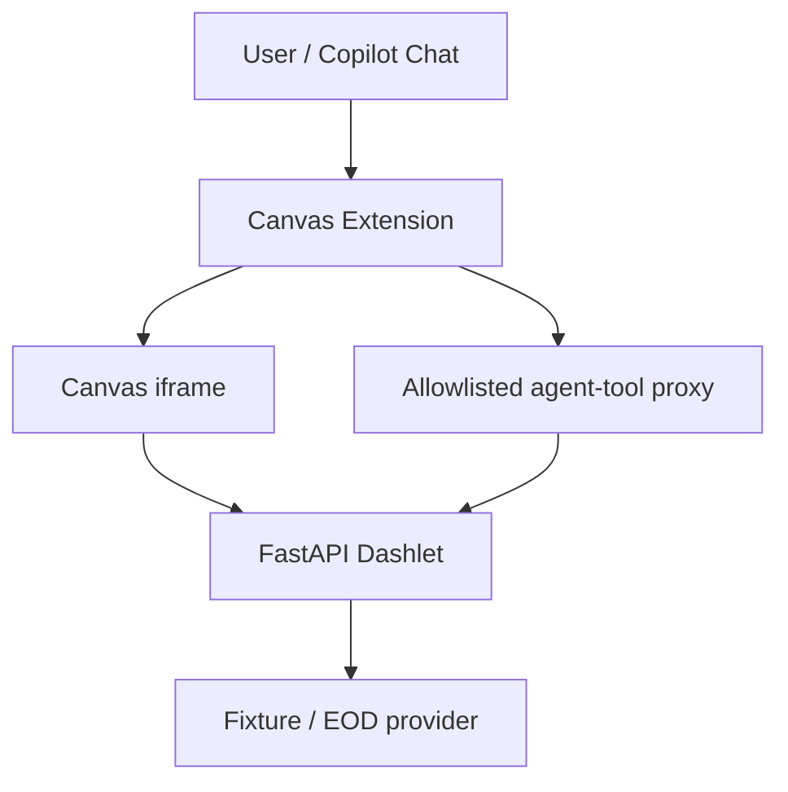

# Canvas Dashlet Studio

A GitHub Copilot Canvas extension and small Python/FastAPI runtime for building **dashlets**: single-file financial monitors that render in a Canvas iframe and expose the same typed operations to Copilot as agent tools.

This repository currently ships three working dashlets — **Hello** (a smoke test), **Treasury Curve** (a reference application with fixture and official end-of-day data), and **Portfolio Exposure** (deterministic long/short/net exposure and concentration from mock positions) — plus the reusable pieces needed to run, extend and validate them.

## 1. What is a dashlet?

A dashlet is a single Python file containing a FastAPI application: its API, embedded HTML/CSS/JavaScript, and one or more typed data or analytics endpoints. It runs as a local process, is displayed inside a Canvas iframe, and can retrieve fixture, live or end-of-day data through a server-side provider.

## 2. Why Canvas + FastAPI + agent tools?

This remains an ordinary client-server web architecture — a browser-rendered iframe talking to a FastAPI backend — with one addition: an **agentic integration layer**. The Canvas extension starts the FastAPI process locally, displays it in an iframe, and separately discovers a subset of its OpenAPI operations to register as Copilot agent tools. No new business logic or protocol is introduced by the agent path; it reuses the same HTTP endpoints the iframe already calls.

## 3. What works today

- Dashlet Studio Canvas extension: select, start, stop, restart, and view diagnostics for any registered dashlet; only one dashlet process runs at a time.
- Hello Dashlet: minimal end-to-end smoke test (`get_dashlet_summary` tool).
- Treasury Curve dashlet: interactive yield curve, slopes and comparison views with explicit fixture/EOD data-mode selection.
- Portfolio Exposure dashlet: deterministic long/short/net exposure by sector and issuer, top concentrations, and a sector-level snapshot comparison, from mock fixture positions (`get_portfolio_exposures`, `get_top_concentrations`, `compare_portfolio_exposures` tools).
- A shared `dashlet_framework/` package (`create_dashlet_app`, the `agent-tool` tag constant, `Provenance`, and error-response models) so every dashlet reuses the same `/health` implementation, error shapes and provenance model instead of duplicating them.
- Agent-tool bridge: only FastAPI operations tagged `agent-tool` and present in the extension's allowlist become Copilot tools; tool arguments are validated before any provider call; tools are isolated per active dashlet. Tool parameter schemas are generated from each dashlet's real OpenAPI output (`scripts/generate_tool_schemas.py`), not hand-maintained.
- Reusable dashlet/OpenAPI contract validation (`tests/test_dashlet_contract.py`, `.github/extensions/dashlet-studio/dashlet-registry.test.mjs`): every registered dashlet is checked automatically for required routes, agent-tool tagging correctness, unique operation IDs and mount-relative fetch paths, with no per-dashlet test code required.
- CI (`.github/workflows/ci.yml`): Ruff, Pytest, a tool-schema drift check, and the Canvas extension's `npm test` run on every push/PR.
- Automated Python (`pytest`) and Node (`node --test`) test suites for the dashlet contract, framework, providers, Canvas runtime, tool proxy and generated tool schemas.

See [`docs/PROGRESS.md`](docs/PROGRESS.md) for the full milestone checklist, current status and the `## Resume here` section describing the next task, and [`AGENTS.md`](AGENTS.md) for the canonical contract any agent (or human) should follow when changing this repository.

## 4. Treasury reference application

The Treasury Curve dashlet (`dashlets/treasury_curve_dashlet.py`) is the manually built reference implementation used to learn and validate the whole platform contract. It exposes three agent-tool-tagged operations — `get_treasury_curve`, `get_treasury_curve_slopes`, `compare_treasury_curves` — each requiring an explicit `data_mode` query parameter (`fixture` or `eod`), with no silent default and no fallback to fixture data if an EOD request fails.

**Treasury EOD data is official end-of-day data retrieved from Treasury.gov — it is not intraday, real-time market data.**

Full validation evidence, including live fixture/EOD results, provenance examples and known limitations, is in [`docs/evidence/treasury-reference.md`](docs/evidence/treasury-reference.md).

## 5. Portfolio Exposure reference application

The Portfolio Exposure dashlet (`dashlets/portfolio_exposure_dashlet.py`) is the first dashlet built on the extracted `dashlet_framework` after the Treasury milestone — it demonstrates the framework generalizing to a second, unrelated business domain. It exposes three agent-tool-tagged operations:

- `get_portfolio_exposures` — long/short/net market value by sector and by issuer for one observation date.
- `get_top_concentrations` — the top issuer and sector concentrations by absolute net exposure weight (`top_n`, bounded 1–20).
- `compare_portfolio_exposures` — sector-level net exposure deltas between two observation dates.

Positions come from deterministic mock fixtures (`fixtures/portfolio/positions_*.json`) — 12 positions across 5 sectors, including two short positions. **There is no live holdings provider for this dashlet**: unlike Treasury's fixture/EOD split, Portfolio Exposure has only a fixture data mode, since PROPOSAL.md's use case is built from mock positions, not a real feed. See [`docs/DATA_ACCESS.md`](docs/DATA_ACCESS.md) §2 for why fixture-first development doesn't always grow a second, live mode.

## 6. Architecture at a glance



The iframe and the Copilot agent both call the **same** FastAPI business operation — `fetch("./api/treasury/curve?...")` from the embedded JavaScript, and the identical `/api/treasury/curve` path via the Canvas tool proxy for the agent. This avoids duplicated business logic and keeps provenance identical for both consumers. See [`docs/ARCHITECTURE.md`](docs/ARCHITECTURE.md) for the full component and data-flow diagrams.

## 7. Technology stack

| Area | Choice |
|---|---|
| Agent workspace | GitHub Copilot App and Canvas |
| Canvas extension | JavaScript / Node.js |
| Runtime | Python, FastAPI, Uvicorn |
| Contracts | Pydantic and OpenAPI |
| Data | HTTPX, provider adapters, deterministic fixtures |
| UI | HTML, Alpine.js, Tailwind CSS, Plotly.js |
| Quality | Pytest, FastAPI `TestClient`, Ruff, Node's built-in test runner |
| Dependency management | `uv` (Python), `npm` (Node) |

## 8. Quick start

Install prerequisites per [`INSTALL.md`](INSTALL.md), then from the repository root:

```bash
uv sync
```

Run a dashlet directly (outside Canvas), for browser or `curl` testing:

```bash
uv run uvicorn dashlets.treasury_curve_dashlet:app --host 127.0.0.1 --port 8765
# or: uv run uvicorn dashlets.portfolio_exposure_dashlet:app --host 127.0.0.1 --port 8765
```

```bash
curl "http://127.0.0.1:8765/health"
curl "http://127.0.0.1:8765/api/treasury/curve?data_mode=fixture"
curl "http://127.0.0.1:8765/api/portfolio/exposures"   # if running the Portfolio Exposure dashlet
```

## 9. Running tests

```bash
uv run ruff check .
uv run pytest
uv run python scripts/generate_tool_schemas.py --check   # verify generated tool schemas aren't stale
```

```bash
cd .github/extensions/dashlet-studio
npm test
```

All four commands run in CI (`.github/workflows/ci.yml`) on every push and pull request. `docs/evidence/treasury-reference.md` has a historical snapshot of these commands from the Treasury milestone, including a small number of then-pre-existing failures that were called out explicitly and have since been fixed.

## 10. Opening Dashlet Studio Canvas

From a Copilot session with this repository open, invoke the `dashlet-studio` Canvas extension. It exposes actions to select a dashlet (`hello`, `treasury-curve`, or `portfolio-exposure`), start it, view runtime diagnostics, restart it, and stop it. Only one dashlet process runs at a time; switching dashlets stops the previous process before starting the next.

## 11. Using Treasury through the iframe

Once the Treasury Curve dashlet is running and displayed in the Canvas iframe, use the on-page controls to choose an observation date and a Data Mode (`fixture` or `eod`). The curve, slope cards, and (when both a base and compare date are selected) the comparison table update together, along with the provenance line showing source, observation date and data mode.

## 12. Using Treasury as an agent tool

While the Treasury Curve dashlet is active, ask Copilot a data question, for example:

> Use the Treasury curve tool to get the fixture curve for 2026-08-19.

Copilot selects the matching approved tool (`get_treasury_curve`, `get_treasury_curve_slopes`, or `compare_treasury_curves`), the Canvas tool proxy validates the arguments against an explicit JSON schema (including the required `data_mode` enum), forwards the request to the same FastAPI endpoint the iframe uses, and returns the validated, provenance-tagged response.

## 13. Fixture versus EOD modes (Treasury only)

Every Treasury operation requires an explicit `data_mode`:

- `fixture` — deterministic, recorded sample data. Safe for demos, tests and CI; no network calls.
- `eod` — official end-of-day yield data fetched live from Treasury.gov.

`data_mode` has no default value: omitting it, or passing an unsupported value, is rejected before any provider is invoked (HTTP 422 from FastAPI, or a client-side rejection in the Canvas tool proxy). An EOD request failure is never silently served from fixture data. Portfolio Exposure has no `data_mode` parameter — see §5.

## 14. Using Portfolio Exposure

Once the Portfolio Exposure dashlet is active in the Canvas iframe, choose an observation date and click **Load** to see the sector net-exposure chart, long/short/net totals, and the top issuer concentrations table. Select a comparison date and click **Compare** to see sector-level exposure deltas.

As an agent tool, ask Copilot, for example:

> Use the portfolio tool to show me the top 3 issuer concentrations for 2026-08-19.

Copilot selects `get_top_concentrations`, validates `top_n` and `date` against the generated schema, forwards the request to `/api/portfolio/concentration`, and returns the same ranked, provenance-tagged response the iframe table shows.

## 15. Evidence and screenshots

See [`docs/evidence/treasury-reference.md`](docs/evidence/treasury-reference.md) for the full validation record: direct FastAPI checks, live Canvas agent-tool invocations, tool-isolation negative tests, process-lifecycle results, and Python/Node test summaries.


A genuine Canvas screenshot (EOD mode) is included above; see [`docs/evidence/treasury-reference.md`](docs/evidence/treasury-reference.md#screenshot) for capture details and provenance. Portfolio Exposure's evidence record is [`docs/evidence/portfolio-exposure-reference.md`](docs/evidence/portfolio-exposure-reference.md) — direct-FastAPI verification and test summaries are complete, but live-Canvas evidence (agent-tool invocation logs, tool-isolation checks, process-lifecycle checks, and a screenshot) is explicitly marked TODO with step-by-step instructions, since no browser tooling was available in the session that built it.

## 16. Repository structure

```text
AGENTS.md                          Canonical instructions for any agent (or human) changing this repository
dashlet_framework/                 Shared app factory, agent-tool tag constant, provenance/error models
dashlets/                          Dashlet FastAPI applications (Hello, Treasury Curve, Portfolio Exposure)
                                    + Treasury/Portfolio providers
portfolio_fixture.py               Portfolio position/exposure models and fixture loading
treasury_fixture.py                Treasury curve models and fixture loading
fixtures/treasury/                 Deterministic Treasury fixture data
fixtures/portfolio/                Deterministic mock portfolio position fixtures
tests/                             Python pytest suite, including the generic dashlet contract validation
tests/js/                          Node-based behavioral tests for the Treasury iframe client
scripts/                           generate_tool_schemas.py (checked in CI) + manual/ad hoc verification scripts
.github/extensions/dashlet-studio/ Canvas extension: process launcher, tool proxy, control server, dashlet
                                    registry, generated tool schemas
.github/workflows/                 CI: Ruff, Pytest, tool-schema drift check, npm test
docs/                              Installation, architecture, roadmap, progress, contract and evidence documentation
```

## 17. Current limitations

- Hello, Treasury Curve and Portfolio Exposure are implemented; Portfolio Scenario Impact and Issuer Research are future work.
- Portfolio Exposure has only a fixture data mode (mock positions) — there is no live holdings feed, unlike Treasury's fixture/EOD split.
- Only one dashlet process runs at a time; there is no concurrent multi-dashlet or cross-dashlet composition view yet.
- Dashlet registration (`DASHLET_REGISTRY` in `dashlet-registry.mjs`) is manual; there is no auto-discovery yet.
- No production sandbox, persistent artifact store, or production identity/authorization model.
- No hosted gallery; all verification has been against locally spawned processes.
- See [`docs/PROGRESS.md`](docs/PROGRESS.md) "Known limitations" for the complete list.

## 18. Roadmap

See [`docs/ROADMAP.md`](docs/ROADMAP.md) for the staged execution plan and [`docs/PROGRESS.md`](docs/PROGRESS.md#resume-here) for the prioritized next task.

## 19. Documentation map

| Document | Purpose |
|---|---|
| [`AGENTS.md`](AGENTS.md) | **Canonical** contract for any agent (or human) changing this repository — start here |
| [`.github/copilot-instructions.md`](.github/copilot-instructions.md) | Copilot-specific notes; points back to `AGENTS.md` |
| [`CLAUDE.md`](CLAUDE.md) | Claude-specific notes; points back to `AGENTS.md` |
| [`docs/DASHLET_CONTRACT.md`](docs/DASHLET_CONTRACT.md) | The structural contract every dashlet file must satisfy |
| [`docs/DATA_ACCESS.md`](docs/DATA_ACCESS.md) | Provider pattern, fixture-first development, provenance rules |
| [`docs/WEB_AUTHORING.md`](docs/WEB_AUTHORING.md) | Alpine/Tailwind/Plotly patterns for a dashlet's embedded page |
| [`docs/TOOL_AUTHORING.md`](docs/TOOL_AUTHORING.md) | How a dashlet operation becomes a Copilot agent tool |
| [`INSTALL.md`](INSTALL.md) | Prerequisites and environment verification |
| [`docs/PROPOSAL.md`](docs/PROPOSAL.md) | Original scope, deliverables and staged evolution |
| [`docs/ARCHITECTURE.md`](docs/ARCHITECTURE.md) | Component boundaries and end-to-end flows |
| [`docs/ROADMAP.md`](docs/ROADMAP.md) | Execution plan and learning resources |
| [`docs/AGENTIC_DEVELOPMENT.md`](docs/AGENTIC_DEVELOPMENT.md) | How coding agents should be used on this project |
| [`docs/PROGRESS.md`](docs/PROGRESS.md) | Milestone checklist, current status and "Resume here" |
| [`docs/evidence/treasury-reference.md`](docs/evidence/treasury-reference.md) | Treasury milestone validation evidence |
| [`docs/evidence/portfolio-exposure-reference.md`](docs/evidence/portfolio-exposure-reference.md) | Portfolio Exposure validation evidence (live-Canvas sections still TODO) |
| [`docs/REFERENCES.md`](docs/REFERENCES.md) | Verified external documentation and learning references |

## 20. References

External documentation for every technology used in this project — GitHub Copilot App, Canvas extensions, FastAPI, Pydantic, Alpine.js, `uv`, Treasury data, and more — is curated in [`docs/REFERENCES.md`](docs/REFERENCES.md).

## 21. Contributing / public-repository safety guidance

This is a public repository. Before committing or opening a pull request:

- Never commit secrets, API keys or tokens; use an ignored `.env` for local-only values.
- Use recorded fixtures instead of live external calls in tests and CI.
- Keep dashlet endpoints restricted to registered providers; do not accept arbitrary URLs or shell commands from requests.
- Run `uv run ruff check .`, `uv run pytest`, `uv run python scripts/generate_tool_schemas.py --check`, and `npm test` (from `.github/extensions/dashlet-studio`) before opening a pull request, and report any pre-existing failures honestly rather than silently working around them.
- Avoid overstating readiness: this project is an MVP-stage reference implementation, not a production system.
