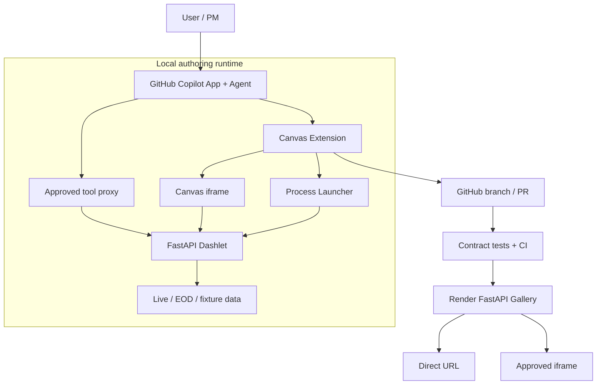

# Architecture

## 1. System context

Canvas Dashlet Studio is a local authoring environment plus a simple hosted gallery.

```text
Copilot Canvas authoring environment
    ├── interprets user requests
    ├── generates or edits Python dashlets
    ├── starts local FastAPI processes
    ├── loads them in an iframe
    └── exposes approved REST endpoints as tools

GitHub development environment
    ├── source control
    ├── issues and pull requests
    ├── validation and review
    └── publication trigger

Render prototype runtime
    ├── hosts one FastAPI gallery
    ├── mounts validated dashlets
    └── provides direct and embeddable URLs
```

## 2. Component view



## 3. Dashlet structure

Each dashlet is a small FastAPI application containing:

- Metadata.
- Embedded HTML.
- Alpine.js behavior.
- Tailwind styling.
- Plotly visualizations.
- Typed data and analytics endpoints.
- Provenance.

Required endpoints:

| Route | Responsibility | Agent tool |
|---|---|---:|
| `GET /` | Return the embedded application | No |
| `GET /health` | Readiness and liveness | No |
| `GET /metadata` | Identity, version and capabilities | No |
| `GET/POST /api/*` | Data and analytics | Explicitly selected |
| `GET /openapi.json` | Tool discovery schema | No |

## 4. Interactive data flow

```text
User changes a control inside iframe
    → Alpine event handler
    → fetch("./api/operation")
    → FastAPI endpoint
    → registered provider
    → normalized data + provenance
    → JSON response
    → Plotly.react updates visualization
```

The `./api/...` mount-relative convention is mandatory so that the same dashlet works locally at `/` and when mounted under `/apps/{id}/`.

## 5. Agent-tool flow

```text
User asks a data question in Copilot
    → agent selects an available tool
    → Canvas tool proxy validates arguments
    → request forwarded to local FastAPI endpoint
    → response validated
    → result returned to agent
    → agent answers or modifies the artifact
```

Tool registration sequence:

1. Start dashlet.
2. Wait for `/health`.
3. Retrieve `/openapi.json`.
4. Select only operations tagged `agent-tool`.
5. Validate unique operation IDs and schemas.
6. Register proxy bindings containing the current port.
7. Remove bindings when the dashlet stops.

### Dual-use business-operation requirement

The UI and agent must use the same typed business operation rather than separate implementations:

| Consumer | Access path |
|---|---|
| Dashlet UI | `fetch("./api/exposures")` from embedded JavaScript |
| Copilot agent | Canvas tool proxy generated from that endpoint's OpenAPI operation |

Each exposed operation requires a stable `operation_id`, useful description, bounded typed parameters, Pydantic response model, `agent-tool` tag, provenance fields and deterministic errors. The proxy adds request/response validation and a timeout.

The extension must not expose every OpenAPI route, accept arbitrary target URLs, duplicate business logic, or delegate deterministic financial calculations to the language model.

## 6. Generation and restart flow

```text
User requests a change
    → agent edits dashlet source
    → validator runs
    → tests run
    → extension stops old process
    → extension starts new process
    → health check passes
    → tools refresh
    → iframe reloads
```

If validation, startup or health checking fails, the prior working source should remain available and the failure should be visible in Canvas.

## 7. Publication flow

```text
Canvas publish request
    → validate dashlet
    → register in gallery
    → create branch / pull request
    → GitHub Actions
    → review and merge
    → Render auto-deploy
    → direct URL returned
```

The Canvas should initiate and display this workflow; it should not bypass review by directly deploying arbitrary generated Python.

## 8. Gallery hosting

The gallery imports and mounts validated applications:

```python
app.mount("/apps/treasury-curve", treasury_curve_app)
app.mount("/apps/portfolio-exposure", portfolio_exposure_app)
app.mount("/apps/scenario-impact", scenario_impact_app)
app.mount("/apps/issuer-research", issuer_research_app)
```

Example URLs:

```text
https://host.example/apps/treasury-curve/
https://host.example/apps/portfolio-exposure/
https://host.example/apps/scenario-impact/
https://host.example/apps/issuer-research/
```

## 9. Security boundary in the MVP

The MVP provides guardrails, not a production sandbox:

- Explicit provider registry.
- No arbitrary URL parameters.
- No browser-side provider credentials.
- Restricted child-process environment.
- `shell: false` when spawning Python.
- Startup and request timeouts.
- Explicit tool allowlist.
- Process-tree cleanup.
- Contract and secret scans.

Stronger isolation is deferred to the security stage.
