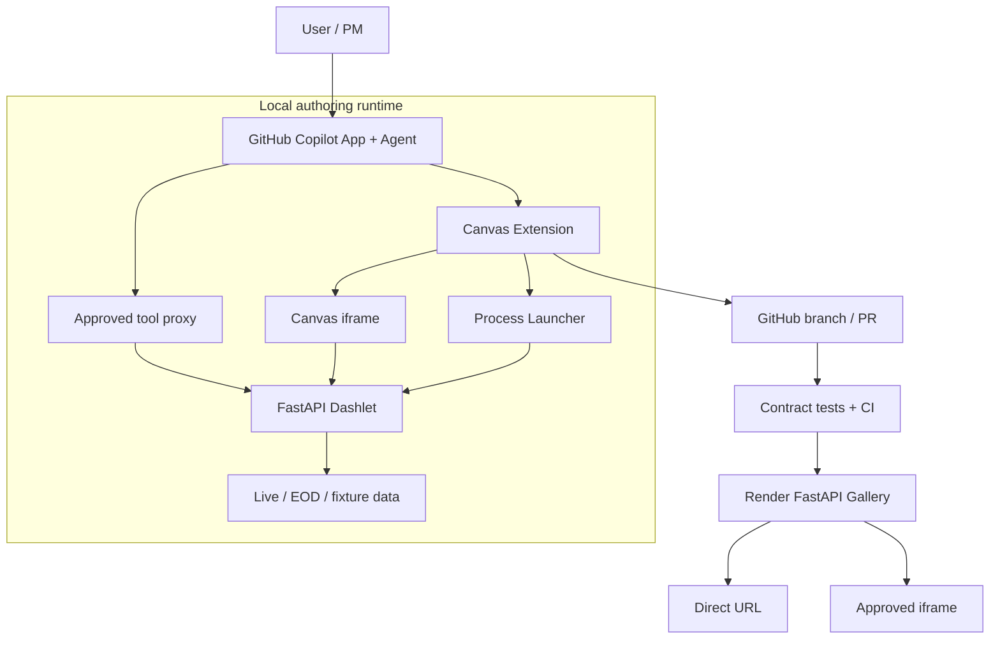

# Architecture

## 1. System context

Canvas Dashlet Studio is a local authoring environment plus a simple hosted gallery.

```text
Copilot Canvas authoring environment
    ├── interprets user requests
    ├── generates or edits Python dashlets
    ├── starts local FastAPI processes
    ├── loads them in an iframe
    └── exposes approved REST endpoints as tools

GitHub development environment
    ├── source control
    ├── issues and pull requests
    ├── validation and review
    └── publication trigger

Render prototype runtime
    ├── hosts one FastAPI gallery
    ├── mounts validated dashlets
    └── provides direct and embeddable URLs
```

## 2. Component view



## 3. Dashlet structure

Each dashlet is a small FastAPI application containing:

- Metadata.
- Embedded HTML.
- Alpine.js behavior.
- Tailwind styling.
- Plotly visualizations.
- Typed data and analytics endpoints.
- Provenance.

The shared pieces above are not reimplemented per dashlet: `/health`, the `agent-tool` tag constant, and the provenance/error-response models are implemented once in `dashlet_framework/` via `create_dashlet_app(title, version)`. See §4 below and [`docs/DASHLET_CONTRACT.md`](DASHLET_CONTRACT.md) for the full structural contract.

Required endpoints:

| Route | Responsibility | Agent tool |
|---|---|---:|
| `GET /` | Return the embedded application | No |
| `GET /health` | Readiness and liveness (registered automatically by `create_dashlet_app`) | No |
| `GET /metadata` | Identity, version and capabilities | No |
| `GET/POST /api/*` | Data and analytics | Explicitly selected |
| `GET /openapi.json` | Tool discovery schema | No |

## 4. Reusable framework and contract validation

`dashlet_framework/` (`app.py`, `models.py`) is the only code shared across dashlets, and is deliberately kept smaller than the applications it enables — see [`docs/PROPOSAL.md`](PROPOSAL.md) §3.1 and [`AGENTS.md`](../AGENTS.md) §5. It provides:

- `create_dashlet_app(title, version)` — constructs the FastAPI app and registers `GET /health`.
- `AGENT_TOOL_TAG` — the single source of truth for the `"agent-tool"` OpenAPI tag string.
- `Provenance`, `DashletErrorDetail`, `DashletErrorResponse` — shared response and error models.

Adding a dashlet to `scripts/generate_tool_schemas.py`'s `DASHLET_MODULES` list (see §6 below) automatically covers it with a generic contract-validation suite — no per-dashlet test code is required for these checks:

- `tests/test_dashlet_contract.py` (Python) — every registered dashlet exposes `/health` and `/metadata`; those two routes are never tagged `agent-tool`; every `agent-tool` operation has a globally unique `operationId` and a declared Pydantic `response_model` (verified by inspecting the real OpenAPI response schema, not just trusting the source); root pages use mount-relative fetch paths only.
- `.github/extensions/dashlet-studio/dashlet-registry.test.mjs` (JS) — the Canvas dashlet registry itself is well-formed, no two dashlets approve the same `operationId`, and every approved tool has an agent-facing description.

Both suites run in CI (`.github/workflows/ci.yml`) alongside Ruff, Pytest, and the tool-schema drift check described in §6.

## 5. Interactive data flow

```text
User changes a control inside iframe
    → Alpine event handler
    → fetch("./api/operation")
    → FastAPI endpoint
    → registered provider
    → normalized data + provenance
    → JSON response
    → Plotly.react updates visualization
```

The `./api/...` mount-relative convention is mandatory so that the same dashlet works locally at `/` and when mounted under `/apps/{id}/`.

## 6. Agent-tool flow

```text
User asks a data question in Copilot
    → agent selects an available tool
    → Canvas tool proxy validates arguments
    → request forwarded to local FastAPI endpoint
    → response validated
    → result returned to agent
    → agent answers or modifies the artifact
```

Tool exposure has two distinct phases. This split exists because Canvas registers tools once, statically, at `joinSession()` — **before any dashlet process is running** — so there is no live `/openapi.json` available at the moment Copilot's tool list is built.

**Phase 1 — static tool visibility (session-scoped; decided ahead of time, not at runtime):**

1. `scripts/generate_tool_schemas.py` imports each registered dashlet's FastAPI app directly — no HTTP call, no process needs to be running — and reads its real `app.openapi()` output.
2. It selects operations tagged `agent-tool`, generically derives a JSON Schema for each operation's query parameters (resolving `$ref` enums and optional/`anyOf` unions — see [`docs/TOOL_AUTHORING.md`](TOOL_AUTHORING.md) §3–4), and writes `.github/extensions/dashlet-studio/generated-tool-schemas.mjs`.
3. At extension startup, `joinSession()` registers one Copilot-visible tool per `operationId` in the union of every dashlet's `approvedTools` (`dashlet-registry.mjs`), using that generated schema.
4. **This tool list never changes for the life of the session.** Starting, stopping, or switching the active dashlet does not add or remove anything from what Copilot can see.
5. CI runs the generator in `--check` mode and fails the build if the committed generated file has drifted from the dashlets' real OpenAPI output.

**Phase 2 — dynamic invocation gating (per active dashlet; decided at runtime):**

1. When a dashlet starts, or the active dashlet changes, the Canvas `ToolProxy` sets its allowlist to that dashlet's `approvedTools` and calls `refresh()`, which fetches the *now-running* dashlet's real `/openapi.json` over HTTP and selects operations that are both tagged `agent-tool` **and** in the allowlist — this becomes `approvedOperations`.
2. When Copilot invokes a tool, `ToolProxy` checks the operation is in `approvedOperations`, validates the arguments against the real OpenAPI parameter list, forwards the request to the running FastAPI endpoint, and returns the validated response.
3. When the dashlet stops or a different dashlet becomes active, `approvedOperations` is cleared — invoking a tool belonging to a different, inactive dashlet fails safely (`"... is not approved"`) even though that tool is still statically visible to Copilot from Phase 1.

The practical effect: Copilot always *sees* every approved tool across every registered dashlet, but can only *successfully invoke* the ones belonging to whichever dashlet is currently running. See also [`AGENTS.md`](../AGENTS.md) §6.

### Dual-use business-operation requirement

The UI and agent must use the same typed business operation rather than separate implementations:

| Consumer | Access path |
|---|---|
| Dashlet UI | `fetch("./api/exposures")` from embedded JavaScript |
| Copilot agent | Canvas tool proxy generated from that endpoint's OpenAPI operation |

Each exposed operation requires a stable `operation_id`, useful description, bounded typed parameters, Pydantic response model, `agent-tool` tag, provenance fields and deterministic errors. The proxy adds request/response validation and a timeout.

The extension must not expose every OpenAPI route, accept arbitrary target URLs, duplicate business logic, or delegate deterministic financial calculations to the language model.

## 7. Generation and restart flow

```text
User requests a change
    → agent edits dashlet source
    → validator runs
    → tests run
    → extension stops old process
    → extension starts new process
    → health check passes
    → tools refresh
    → iframe reloads
```

If validation, startup or health checking fails, the prior working source should remain available and the failure should be visible in Canvas.

## 8. Publication flow

```text
Canvas publish request
    → validate dashlet
    → register in gallery
    → create branch / pull request
    → GitHub Actions
    → review and merge
    → Render auto-deploy
    → direct URL returned
```

The Canvas should initiate and display this workflow; it should not bypass review by directly deploying arbitrary generated Python.

## 9. Gallery hosting

The gallery imports and mounts validated applications:

```python
app.mount("/apps/treasury-curve", treasury_curve_app)
app.mount("/apps/portfolio-exposure", portfolio_exposure_app)
app.mount("/apps/scenario-impact", scenario_impact_app)
app.mount("/apps/issuer-research", issuer_research_app)
```

Example URLs:

```text
https://host.example/apps/treasury-curve/
https://host.example/apps/portfolio-exposure/
https://host.example/apps/scenario-impact/
https://host.example/apps/issuer-research/
```

## 10. Security boundary in the MVP

The MVP provides guardrails, not a production sandbox:

- Explicit provider registry.
- No arbitrary URL parameters.
- No browser-side provider credentials.
- Restricted child-process environment.
- `shell: false` when spawning Python.
- Startup and request timeouts.
- Explicit tool allowlist.
- Process-tree cleanup.
- Contract validation (implemented — `tests/test_dashlet_contract.py`, `dashlet-registry.test.mjs`, run in CI on every push/PR; see §4).
- Secret scanning (**not yet implemented** — tracked in `docs/PROGRESS.md` Milestone 5; do not assume CI would catch a committed secret today).

Stronger isolation is deferred to the security stage.
